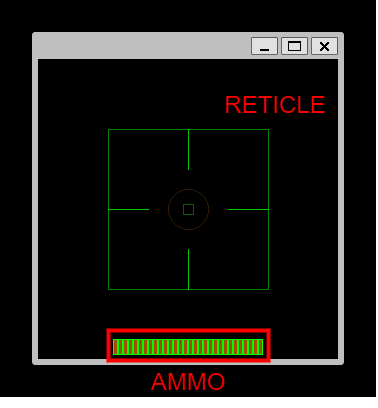

# MAZE2 日本語版
## 概要
これは大学の授業の一環で制作した作品を成果物としてgithubに避難させたものです。

StdioやMathやX11/Xlibのような標準的なライブラリ以外を使わずにC言語でゲームを作ろうという課題に対して0から基本的な疑似3DのFPSゲームを制作しました。
製作期間は１か月ほどであり未実装の部分もありますが、ひととおり遊べるようになっています。


## 準備
### 前提
makefileを利用できるC/C++開発環境下

### 実行ファイル作成
X11の開発ライブラリが必要です。UbuntuやDebianであれば次のように
```
sudo apt install libx11-dev
```
を利用してライブラリをインストールしてください。Windows環境下であればWSLを利用することを推奨します。
他にもpthreadなどのライブラリが不足してビルドできない場合があるので注意してください

### 起動
ビルドと実行を一挙に行います。次のように入力してください。
```
make run
```


## 操作方法
### 注意
**起動したターミナルを選択しないと入力を受け付けないので、画面の位置などを調整した際に操作が効かないと感じたらターミナルをマウスでクリックするなどして選択状態にしてください。**

### メニュー操作

| キー | 操作内容                       | 
| ---- | ------------------------------ | 
| w    | 新規ゲームを選択               | 
| s    | 作成済みマップを選択（未実装） | 
| x    | ゲームをやめるを選択           | 
| k    | 決定                           | 
|      |                                | 
### ゲーム本編
| キー | 操作内容                   | 
| ---- | -------------------------- | 
| w    | 前進                       | 
| a    | 左移動                     | 
| s    | 後退                       | 
| d    | 右移動                     | 
|      |                            | 
| j    | 左旋回                     | 
| k    | 右旋回                     | 
| i    | 武器を発射                 | 
|      |                            | 
| r    | 武器のリロード             | 
| e    | ランダムな位置にテレポート | 
| u    | 180度回転                  | 



